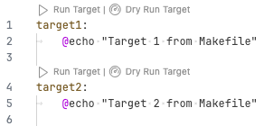
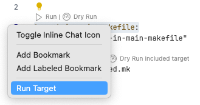
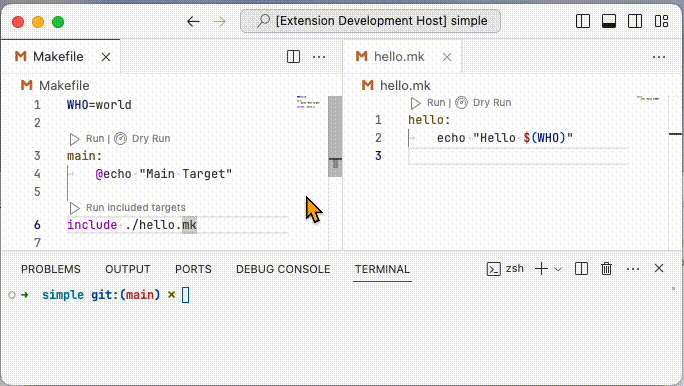

# Targets Runner

Run Makefiles and [justfiles](https://github.com/casey/just) directly from your editor.
Available for download at the [VSCode Marketplace](https://marketplace.visualstudio.com/items?itemName=mazenb.mk-targets-runner).

# Key Features

## Inline Runner

Toggle this feature using `mk-targets-runner.enableInlineTargetRunner`.

or from the gutter:

## Quickpick Menu for Running any Target

## Support for Included Files

Run targets targets from included files:

## Additional Features

- Re-run last target
- Support for [`justfile`-comments](https://github.com/casey/just#documentation-comments) (shown as description in the picker)
- Proper execution of included files, ensuring variables defined in one file are recognized in included targets.

# Configurations

<!-- START_CONFIG_TABLE -->

| Property                                     | Description                                           | Type      | Default Value                                |
| -------------------------------------------- | ----------------------------------------------------- | --------- | -------------------------------------------- |
| `mk-targets-runner.command.make`             | The command to run makefiles targets.                 | `string`  | `make -C <dir> -f <fsPath> <name>`           |
| `mk-targets-runner.command.just`             | The command to run justfiles targets.                 | `string`  | `just -d <dir> -f <fsPath> <name>`           |
| `mk-targets-runner.dryrun.make`              | The command to run makefiles targets in dry-run mode. | `string`  | `make -C <dir> -f <fsPath> --dry-run <name>` |
| `mk-targets-runner.dryrun.just`              | The command to run justfiles targets in dry-run mode. | `string`  | `just -d <dir> -f <fsPath> --dry-run <name>` |
| `mk-targets-runner.filePattern.make`         | The glob patterns to match makefiles.                 | `array`   | `['Makefile', '*.mk']`                       |
| `mk-targets-runner.filePattern.just`         | The glob patterns to match justfiles.                 | `array`   | `['justfile', '*.just']`                     |
| `mk-targets-runner.excludedFoldersPatterns`  | The glob patterns to exclude folders.                 | `array`   | `['**/.git', '**/node_modules']`             |
| `mk-targets-runner.enableInlineTargetRunner` | Enable inline target runner.                          | `boolean` | `True`                                       |
| `mk-targets-runner.inlineRunnerLocation`     | Where to show the inline target runner.               | `string`  | `target`                                     |

<!-- END_CONFIG_TABLE -->

## TODO

- [ ] Timeout for finding targets
- [ ] Add tasks via the [`TaskProvider`](https://code.visualstudio.com/api/extension-guides/task-provider)
- [ ] Right now the extension uses the activation event `onLanguage` since the extension should be activated for any targetfile type which is dynmically determined. This is not ideal since it will be activated for any file
- Extend support to include Rakefile and Python typer
- Git hooks for:
  - [ ] Tests
  - [ ] Linting
  - [ ] Configurations generation
- [ ] Add tests
- [ ] Auto increment version with commit and auto append commit messages to `CHANGELOG.md`
- [ ] Add a visual indication (e.g., spinner) to show the extension is actively searching for targets

# Helpful Resources

- [Task Provider](https://code.visualstudio.com/api/extension-guides/task-provider)
- icons
  - [Icons for Visual Studio Code](https://github.com/microsoft/vscode-icons)
  - [Codicon icon font](https://microsoft.github.io/vscode-codicons/dist/codicon.html)
- [Testing Extensions](https://code.visualstudio.com/api/working-with-extensions/testing-extension)

# Developer Notes

- To enable `glob` import, it was necessary to **shift** it from `devDependencies` to `dependencies` in `package.json` (see [this discussion](https://stackoverflow.com/a/76257922/1617883)). Without this change, the extension failed to activate with an error "Cannot find module 'glob'", a problem not encountered in debug mode.
