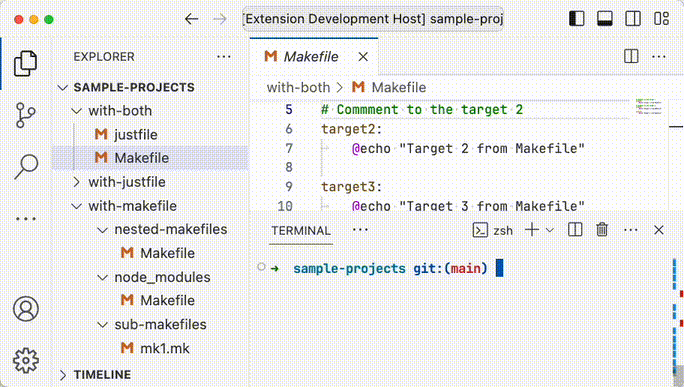

# Targets Runner

Run targets from Makefiles and [justfiles](https://github.com/casey/just) in VSCode.

Demo: 

## Expected files patters

For makefiles:

- `Makefile`
- `*.mk`

For justfiles:

- `justfile`
- `*.just`

TODO: Can be configured in settings.

# Features

- Separator per file
- Support for [`justfile`-comments](https://github.com/casey/just#documentation-comments) (shown as description in the picker)
- Run included files from correct file. Example: if variable is defined in a file and then a target is included that uses this variable, the variable is not defined in the included file!

## TODO

- [ ] Configurations for:
  - [ ] excluded files
  - [ ] matching patterns and regexes
  - [ ] run-commands (now they are `make -f <file> <target>` and `just -f <file> <target>`)
- [ ] Timeout for finding targets
